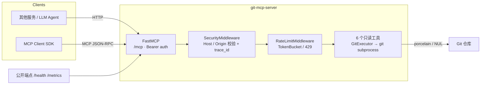

# git-mcp-server

只读访问 Git 仓库的 [MCP](https://modelcontextprotocol.io/) Server（Streamable HTTP）。
基于官方 `mcp` Python SDK（FastMCP），提供 6 个只读工具，内置原生 Bearer 认证、Origin/Host 防护与路径沙箱，可独立部署，供其他服务通过 MCP 协议调用。

## 功能特性

- **纯只读**：status / log / show / branches / grep / blame，无任何写操作
- **MCP Streamable HTTP**：标准端点 `/mcp`，`json_response` 模式
- **原生认证**：FastMCP `token_verifier`，配置 `AUTH_TOKEN` 后 `/mcp` 强制 Bearer 校验
- **5 层安全防护**：网络（Origin/Host）→ 认证 → 路径沙箱 → 超时/输出上限 → 输入校验
- **subprocess + list 参数**执行 git：无 shell 注入，显式超时，安全环境变量
- **可观测性**：Prometheus `/metrics` + trace_id 请求日志
- **动态工具开关**：`TOOLS_ENABLED` 可按需启用子集

## 架构图



中间件栈（由外到内）：

```
HTTP 请求
  │
  ├─ /health、/metrics  ──► 公开（探活 / 监控）
  │
  └─ /mcp  ──► SecurityMiddleware（Host/Origin 校验、注入 trace_id）
                 └──► RateLimitMiddleware（TokenBucket，默认关闭）
                        └──► FastMCP（token_verifier 强制 Bearer 认证）
                               └──► 6 个只读工具
```

## 目录结构

```
servers/git-mcp-server/
├── Dockerfile
├── README.md
├── pyproject.toml          # 运行时依赖（mcp / pydantic / uvicorn / starlette）
├── .env.example            # 配置模板
├── src/git_mcp_server/
│   ├── server.py           # FastMCP 组装 + ASGI 构建 + /health /metrics
│   ├── config.py           # pydantic-settings 统一配置
│   ├── errors.py           # AppError + ErrorCode（MCP JSON-RPC 错误码映射）
│   ├── metrics.py          # Prometheus 指标
│   ├── auth/
│   │   ├── token_verifier.py  # 静态 Bearer Token 校验器（AccessToken 协议）
│   │   └── sandbox.py         # 仓库路径白名单 / symlink 解析 / 越界拦截
│   ├── middleware/
│   │   ├── security.py        # Host / Origin 校验 + trace_id
│   │   └── rate_limit.py      # TokenBucket 限流
│   └── tools/
│       ├── base.py            # tool_guard 装饰器 + require_repo
│       └── git/
│           ├── executor.py    # git subprocess 执行（超时/输出上限/安全 env）
│           └── operations.py  # 6 个只读工具
└── tests/                 # 11 个测试文件（单元 + 端到端 ASGI）
```

## 快速开始

前置：Python 3.11+、[uv](https://docs.astral.sh/uv/)、git。

```bash
# 1) 同步依赖（workspace 根执行）
uv sync --all-packages

# 2) 配置环境变量
cd servers/git-mcp-server
cp .env.example .env
# 编辑 .env：GIT_ALLOWED_ROOTS 指向你的仓库目录（逗号分隔可多个）

# 3) 启动
uv run python -m git_mcp_server
```

启动日志示例：

```
INFO:     Started server process [12345]
INFO:     Waiting for application startup.
INFO:     Application startup complete.
INFO:     Uvicorn running on http://127.0.0.1:8000 (Press CTRL+C to quit)
INFO:     git_mcp_server.security: request trace_id=a1b2c3d4e5f60718 method=POST path=/mcp host=127.0.0.1:8000
INFO:     git_mcp_server.security: request trace_id=e9f8a7b6c5d4e3f2 method=POST path=/mcp host=127.0.0.1:8000
```

## 工具列表

| 工具 | 说明 | 底层命令 | 限制 |
|------|------|----------|------|
| `get_repo_status` | 工作区状态（porcelain v2） | `git status --porcelain=v2 --branch` | — |
| `get_commit_log` | 分支提交历史 | `git log -n N --pretty=tformat:...` | ≤100 条 |
| `get_commit_detail` | 单提交元数据 + diffstat | `git show -s ...` + `git show --stat` | — |
| `list_branches` | 本地/远程跟踪分支 | `git for-each-ref refs/heads refs/remotes` | — |
| `search_code` | 受跟踪文件全文搜索 | `git grep -n --column` | — |
| `blame_file` | 按行追溯 | `git blame --line-porcelain -L` | ≤500 行/次 |

所有路径/提交参数均经 `--end-of-options` / `--` 处理，防止选项注入；输出使用 porcelain/NUL 机器可读格式解析，避免文本解析脆弱性。

## 配置项

| 环境变量 | 默认值 | 说明 |
|----------|--------|------|
| `ENVIRONMENT` | `development` | `production` 强制要求认证与仓库白名单 |
| `BIND_HOST` / `BIND_PORT` | `127.0.0.1` / `8000` | 监听地址 |
| `AUTH_TOKEN` | 空 | Bearer Token；生产必填，否则拒绝启动 |
| `GIT_ALLOWED_ROOTS` | 空 | 仓库路径白名单（逗号分隔）；为空 fail-closed 拒绝所有仓库 |
| `GIT_COMMAND_TIMEOUT_SEC` | `30.0` | git 命令超时（秒） |
| `GIT_MAX_OUTPUT_BYTES` | `1048576` | 单命令输出上限（1MB） |
| `ALLOWED_ORIGINS` | 空 | Origin 白名单；为空仅放行无 Origin 请求（防 DNS rebinding） |
| `ALLOWED_HOSTS` | `localhost,127.0.0.1,::1` | Host 头白名单 |
| `RATE_LIMIT_ENABLED` | `false` | 是否启用限流 |
| `RATE_LIMIT_MAX_REQUESTS` | `100` | 窗口内最大请求数 |
| `RATE_LIMIT_WINDOW_SECONDS` | `60` | 限流窗口（秒） |
| `TOOLS_ENABLED` | 空 | 逗号分隔工具名；为空全部启用 |
| `METRICS_ENABLED` | `true` | 是否暴露 `/metrics` |
| `LOG_LEVEL` | `INFO` | 日志级别 |
| `OTEL_ENABLED` / `OTEL_EXPORTER_OTLP_ENDPOINT` | `false` / 空 | OpenTelemetry（需安装 `[otel]` extra） |

## 客户端集成

本 server 运行在 **Streamable HTTP** 模式（端点 `/mcp`），不提供 stdio 传输。其他服务通过 HTTP 方式调用：

> ⚠️ 不要使用 `uvx git-mcp-server` 运行：PyPI 上存在同名的**第三方** `git-mcp-server` 包（基于 mcp 2.x，内部为 `git_mcp`），与本地项目无关且无法加载本项目的 FastMCP v1 代码。请始终通过下方「方式一」在本地启动。

**方式一：本地启动（uv workspace 内）= 启动 Server（服务端）**

```bash
# 在 workspace 根目录
uv run --directory servers/git-mcp-server python -m git_mcp_server
# 或进入 servers/git-mcp-server 后
cd servers/git-mcp-server && uv run python -m git_mcp_server
```

**方式二：Python 客户端（`mcp` SDK，HTTP）**

```python
import asyncio

from mcp import ClientSession
from mcp.client.streamable_http import streamablehttp_client

URL = "http://127.0.0.1:8000/mcp"


async def main():
    # SDK v1：上下文产出 3 个值 (read, write, get_session_id)
    async with streamablehttp_client(
        URL, headers={"Authorization": "Bearer <your-token>"}
    ) as (read, write, _):
        async with ClientSession(read, write) as session:
            await session.initialize()
            tools = await session.list_tools()
            result = await session.call_tool(
                "get_commit_log",
                {"repo_path": "/srv/repos/my-repo", "max_count": 5},
            )


asyncio.run(main())
```

**方式三：通用 MCP JSON 配置（HTTP，推荐用于独立部署）**

```json
{
  "mcpServers": {
    "git-mcp-server": {
      "type": "http",
      "url": "http://127.0.0.1:8000/mcp",
      "headers": {
        "Authorization": "Bearer <your-token>",
        "Origin": "http://127.0.0.1:8000"
      }
    }
  }
}
```

> 提示：若部署在不同 Host/Origin 下，请将调用方的 Origin 加入 `ALLOWED_ORIGINS`，否则请求会被安全中间件以 HTTP 403 拦截（MCP 规范 MUST）。

## Docker 部署

```bash
# 构建（在 workspace 根或本目录执行）
docker build -t git-mcp-server:0.1.0 -f servers/git-mcp-server/Dockerfile servers/git-mcp-server

# 运行（只读挂载仓库目录）
docker run --rm -p 8000:8000 \
  -e ENVIRONMENT=production \
  -e AUTH_TOKEN="$(python -c 'import secrets;print(secrets.token_urlsafe(32))')" \
  -e GIT_ALLOWED_ROOTS=/srv/repos \
  -v /absolute/path/to/repos:/srv/repos:ro \
  git-mcp-server:0.1.0
```

镜像内置 `/health` 健康检查（HEALTHCHECK），探活端点返回 `{"status":"ok","version":...,"service":"git-mcp-server"}`。

## 安全设计

| 层级 | 机制 | 说明 |
|------|------|------|
| 网络 | `SecurityMiddleware` | Host/Origin 白名单校验，仅对 `/mcp` 生效；`/health`、`/metrics` 公开 |
| 认证 | FastMCP `token_verifier` | 配置 `AUTH_TOKEN` 后 `/mcp` 强制 Bearer 校验（fail-closed） |
| 路径沙箱 | `auth/sandbox.py` | 仓库路径白名单 + `realpath` 解析 symlink，越界返回 `PERMISSION_DENIED` |
| 资源限制 | `GitExecutor` | 显式超时（默认 30s）+ 输出字节上限（1MB）+ 安全 env（`GIT_TERMINAL_PROMPT=0` 等） |
| 输入校验 | pydantic `Field` | 参数范围/长度约束；git 子进程使用 list 参数，杜绝 shell 注入 |
| 限流 | `RateLimitMiddleware` | TokenBucket，超限返回 429 + `Retry-After`（默认关闭） |

## 测试

```bash
# 单元 + 端到端（initialize → tools/list → tools/call）
uv run pytest servers/git-mcp-server/tests -v

# lint / 类型检查
uv run ruff check servers/git-mcp-server/src servers/git-mcp-server/tests
uv run mypy -p git_mcp_server
```

覆盖点：配置校验、认证（有效/无效/未配置）、路径沙箱（越界/symlink/fail-closed）、SecurityMiddleware（Host/Origin/trace_id）、限流、Prometheus 指标、6 个工具行为（subprocess 临时 git 仓库 fixture）、MCP 协议端到端兼容性。

## 相关文档

- [设计文档](../../docs/git-mcp-server-design.md) — 架构决策、工具规格与安全设计的完整说明
- [CHANGELOG.md](../../CHANGELOG.md) — 变更日志
